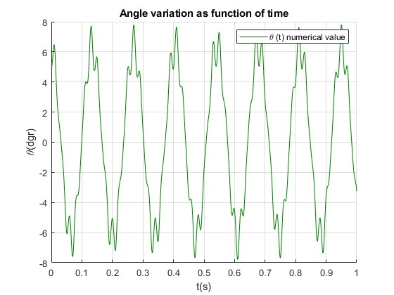

# kapitza-pendulum
MATLAB finite-difference (FDM) simulation of the Kapitza pendulum with trajectory and angle–time plots.

# Kapitza Pendulum (MATLAB) — Finite-Difference Simulation

Single-file MATLAB simulation of the **Kapitza pendulum** (an inverted pendulum with a vertically oscillating support).  
The script integrates the nonlinear equation of motion using a **finite-difference (FDM) time-stepping scheme** and visualizes the dynamics with two plots:
1) **Angle vs. time** (θ(t))  
2) **Pendulum trajectory** in the (x, y) coordinates

---

## File

- `kapitza_pendulum.m`

This script contains:
- physical constants and parameters
- initial conditions
- numerical integration loop (finite differences)
- plotting section

---

## Model & Parameters (from the script)

- `g = 9.80665` m/s² — gravitational acceleration  
- `l = 1` m — pendulum length  
- `T = 0.02` s — support point oscillation period  
- `omega = 2*pi/T` 1/s — support point frequency  
- `A = 0.2` m — support point oscillation amplitude  
- `tf = 1` s — total simulation time  
- `N = 1000` — number of time samples  
- `t = linspace(0, tf, N)` — temporal discretization, `dt = t(2)-t(1)`  
- initial angle: `thetai = 5` degrees (with `theta(1) = theta(2) = thetai*pi/180`)

---

## Numerical Method (brief)

The angular position `theta` is updated using a **second-order finite-difference scheme**:

- second-order time update (uses `theta(i-1)`, `theta(i)`, `theta(i+1)`, with `i:2->N-1`)
- nonlinear term `sin(theta(i))`
- parametric excitation term from the vibrating support: `cos(omega * t) * sin(theta(i))`

The bob coordinates are computed as:
- `x = l * sin(theta)`
- `y = A * sin(omega * t) + l * cos(theta)`

---

## Outputs

Running the script generates:

1. **Angle variation as a function of time**  
   Plot of `theta(t)` in degrees.

2. **Pendulum coordinates (trajectory)**  
   Plot of `(x(t), y(t))`in meters.

> Note: `x(N)` and `y(N)` have the value `0` so the lenght of the pendulum is visible

---

## Output Example

